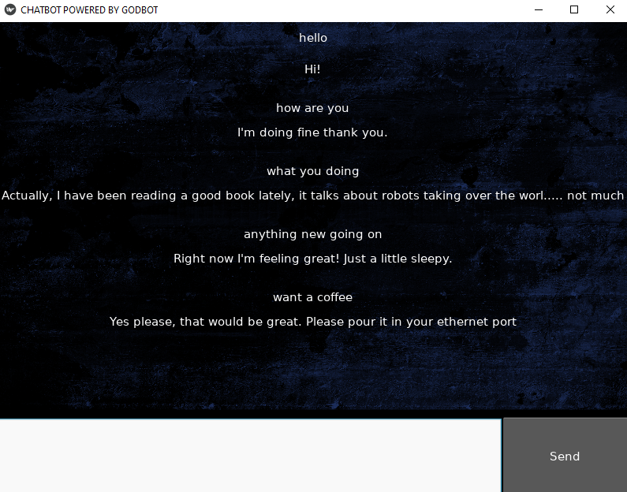

# Chatbot
This is a python chatbot using SpiCy and Kivy

You can enter text into the input box and press enter or click in the send button to create an interaction with the chatbot.

This bot can answer to several messages just like the following displayed on image:

